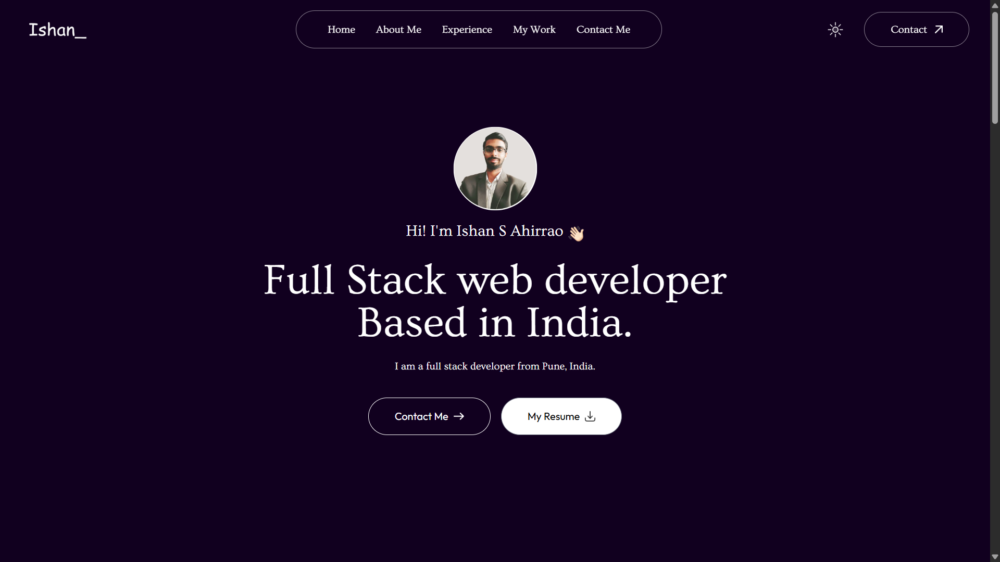
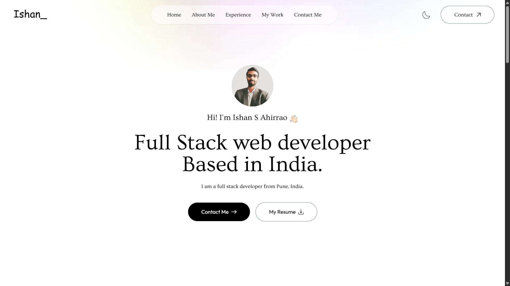

# 🌐 Ishan Ahirrao - Portfolio Website

This is my personal portfolio website showcasing my projects, skills, and projects as a web developer.  
Built with modern web technologies to provide a fast, responsive, and user-friendly experience.

## 🚀 Features

- **Responsive Design** – Works smoothly on all devices (desktop, tablet, mobile).
- **Projects Showcase** – Displays my completed and ongoing projects.
- **About Me Section** – Highlights my background, skills, and experience.
- **Contact Form** – Easy way for visitors to connect with me.
- **Dark/Light Mode** – Switchable theme for better user experience.

## 🚀 Live Demo

🌐Live Demo :  [Visit Live](https://ishan-portfolio-new.vercel.app/)

## 🛠 Tech Stack

- **Frontend:** next.js, Tailwind CSS
- **Deployment:** Vercel

## 📸 Screenshots

### 🏠 Dark Mode

### 📂 Light Mode

